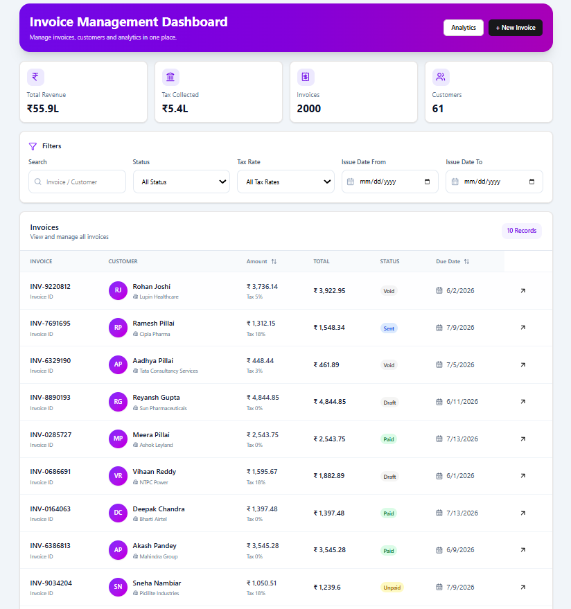
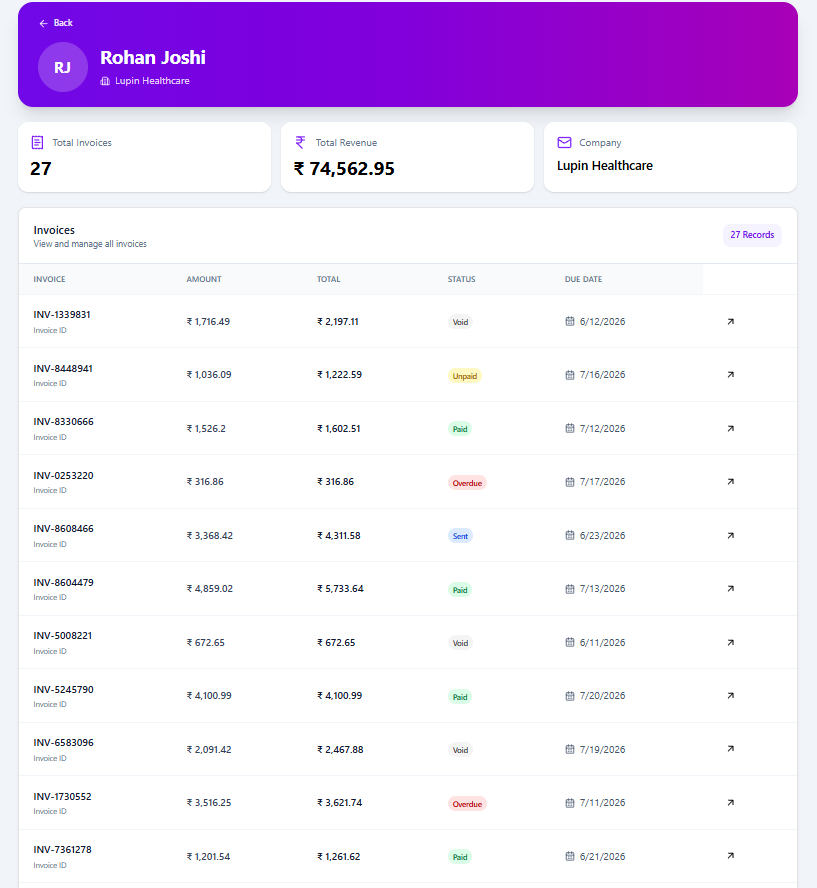
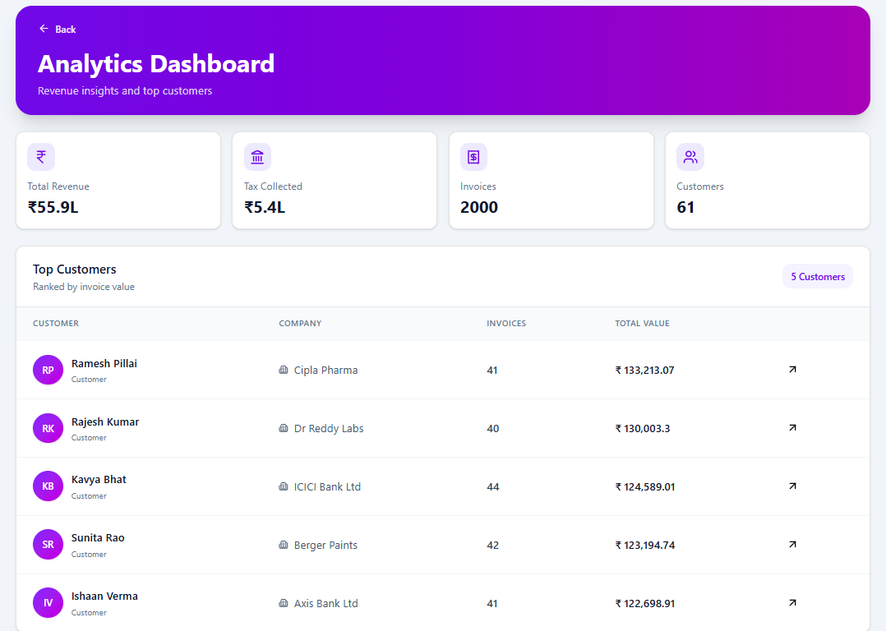

# PowerPlay Invoice Dashboard

Full Stack Invoice Management Dashboard built with React, TypeScript, Express, MongoDB, and Docker.

---

# Tech Stack

## Frontend

* React 19
* TypeScript
* Vite
* React Router
* React Query
* React Hook Form
* Tailwind CSS
* Axios
* Zod

## Backend

* Node.js
* Express
* TypeScript
* MongoDB
* Mongoose
* Zod

## DevOps

* Docker
* Docker Compose

## Testing

* Jest
* Supertest

---

# Features

## Invoice Management

* View invoices
* Create invoice
* Edit invoice
* Invoice details modal
* Status tracking
* Tax calculation
* Validation using Zod

## Dashboard

* Revenue summary
* Tax summary
* Total invoices
* Total customers

## Filtering & Search

* Search invoices
* Filter by status
* Filter by tax rate
* Filter by issue date range
* Server-side pagination
* Sorting by amount
* Sorting by due date

## Customer Profiles

* Customer details
* Customer revenue summary
* Invoice history
* Quick navigation from analytics

## Analytics

* Total billed amount
* Total tax collected
* Invoice count
* Customer count
* Top customers by invoice value

## API Testing

* Health endpoint test
* Analytics endpoint test
* Customers endpoint test
* Invoices endpoint test
* Validation test

---

# Project Structure

```text
powerplay-invoice-dashboard/

├── frontend/
│   ├── src/
│   ├── public/
│   ├── Dockerfile
│   └── package.json
│
├── backend/
│   ├── src/
│   │   ├── config/
│   │   ├── middleware/
│   │   ├── modules/
│   │   │   ├── analytics/
│   │   │   ├── customer/
│   │   │   └── invoice/
│   │   ├── scripts/
│   │   ├── app.ts
│   │   └── server.ts
│   │
│   ├── tests/
│   ├── Dockerfile
│   ├── package.json
│   └── .env.example
│
├── docker-compose.yml
└── README.md
```

---

# Data Models

## Customer

```ts
{
  _id: ObjectId,
  name: string,
  company: string,
  createdAt: Date,
  updatedAt: Date
}
```

### Index

```ts
name
```

Unique customer names are enforced.

---

## Invoice

```ts
{
  invoiceId: string,
  customerId: ObjectId,
  amount: number,
  taxRate: number,
  tax: number,
  total: number,
  status: string,
  issueDate: Date,
  dueDate: Date,
  createdAt: Date,
  updatedAt: Date
}
```

### Status Values

```text
Draft
Sent
Unpaid
Paid
Overdue
Void
```

### Supported Tax Rates

```text
0%
3%
5%
18%
28%
```

### Indexes

```ts
customerId
status
issueDate
```

Added to improve query performance.

---

# Environment Variables

Create a `.env` file in the backend directory.

Example:

```env
PORT=5000
MONGODB_URI=mongodb://localhost:27017/powerplay
```

A sample configuration is already available in:

```text
backend/.env.example
```

---

# Local Development Setup

## 1. Clone Repository

```bash
git clone https://github.com/kartikrathod23/powerplay-invoice-dashboard
cd powerplay-invoice-dashboard
```

---

## 2. Backend Setup

```bash
cd backend

npm install
```

Create environment file:

```bash
cp .env.example .env
```

Start backend:

```bash
npm run dev
```

Backend runs on:

```text
http://localhost:5000
```

---

## 3. Frontend Setup

```bash
cd frontend

npm install
```

Start frontend:

```bash
npm run dev
```

Frontend runs on:

```text
http://localhost:5173
```

---

# Database Seeding

Populate MongoDB with sample data.

```bash
cd backend

npm run seed
```

This generates:

* Customers
* Invoices
* Analytics data

---

# Docker Setup

## Build Containers

From project root:

```bash
docker compose build
```

---

## Start Containers

```bash
docker compose up -d
```

---

## Stop Containers

```bash
docker compose down
```

---

## View Logs

```bash
docker compose logs -f
```

---

# Running Tests

Tests are implemented using Jest and Supertest.

Run all tests:

```bash
cd backend

npm test
```

Current test coverage includes:

```text
✓ Health API
✓ Analytics API
✓ Customers API
✓ Invoices API
✓ Validation API
```

Example output:

```text
Test Suites: 5 passed
Tests: 5 passed
```

---

# API Endpoints

## Health

### GET /health

Response

```json
{
  "success": true,
  "message": "Server is healthy"
}
```

---

# Invoices

## GET /api/invoices

Supports:

```text
page
limit
search
status
taxRate
issueDateFrom
issueDateTo
sortBy
sortOrder
```

Response

```json
{
  "success": true,
  "data": [],
  "pagination": {
    "page": 1,
    "totalPages": 10,
    "totalRecords": 200
  }
}
```

---

## GET /api/invoices/:invoiceId

Response

```json
{
  "success": true,
  "data": {}
}
```

---

## POST /api/invoices

Request

```json
{
  "invoiceId": "INV-1001",
  "customerId": "...",
  "amount": 1000,
  "taxRate": 18,
  "status": "Draft",
  "issueDate": "2026-01-01",
  "dueDate": "2026-01-15"
}
```

Response

```json
{
  "success": true,
  "message": "Invoice created successfully",
  "data": {}
}
```

---

## PUT /api/invoices/:invoiceId

Updates an existing invoice.

Response

```json
{
  "success": true,
  "message": "Invoice updated successfully",
  "data": {}
}
```

---

# Customers

## GET /api/customers

Response

```json
{
  "success": true,
  "data": []
}
```

---

## GET /api/customers/:customerId

Response

```json
{
  "success": true,
  "data": {
    "customer": {},
    "summary": {},
    "invoiceHistory": []
  }
}
```

---

# Analytics

## GET /api/analytics/summary

Response

```json
{
  "success": true,
  "data": {
    "totalBilled": 5597650.28,
    "totalTax": 540829.76,
    "invoiceCount": 2002,
    "customerCount": 61,
    "topCustomers": []
  }
}
```

---

# Validation

Request validation is implemented using Zod.

Validation is applied on:

* Invoice creation
* Invoice update
* Query parameters
* Route parameters

Invalid requests return:

```json
{
  "success": false,
  "message": "Validation Error"
}
```

---

# Trade-offs & Assumptions

## Authentication

Authentication and authorization were intentionally not implemented because they were outside the assignment scope.
All APIs are currently publicly accessible.

## Database

MongoDB indexes were added only on fields frequently used for filtering and sorting:
- customerId
- status
- issueDate

Additional indexes can be introduced based on production query patterns.

## Analytics

Analytics are calculated from invoice data using MongoDB aggregation pipelines.
For larger datasets, these values could be precomputed and cached.

## Testing

The project includes API and validation tests using Jest and Supertest.
Frontend component testing was not implemented due to time constraints and assignment priorities.

## Pagination

Pagination is implemented server-side to avoid loading large datasets into the browser.

## Docker

Docker Compose is configured for local development and evaluation.
Production deployments would typically use managed MongoDB services and separate deployment pipelines.

---

# Screenshots

## Dashboard



## Customer Profile



## Analytics



---

# Author

Kartik Rathod
B.Tech CSE
Indian Institute of Information Technology Vadodara
